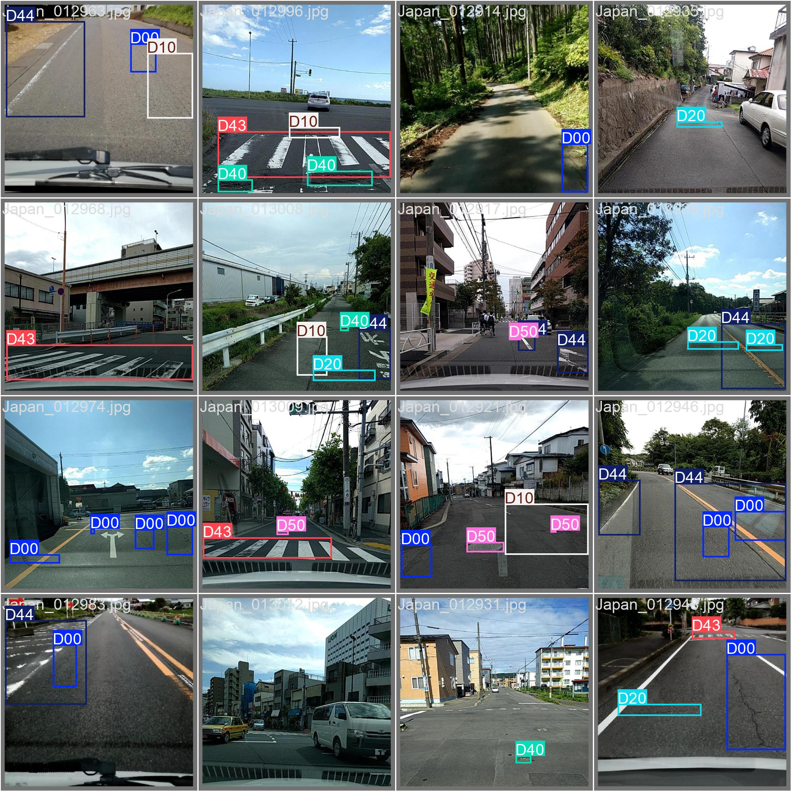
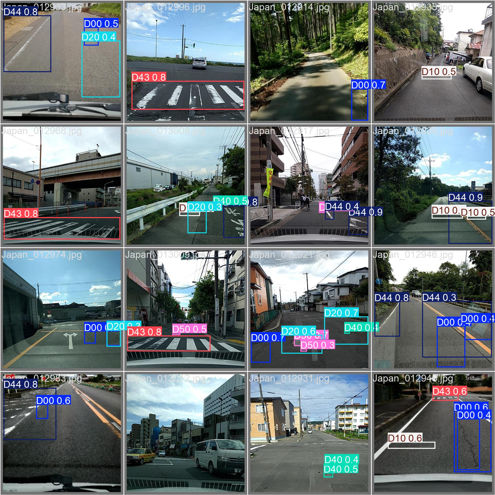
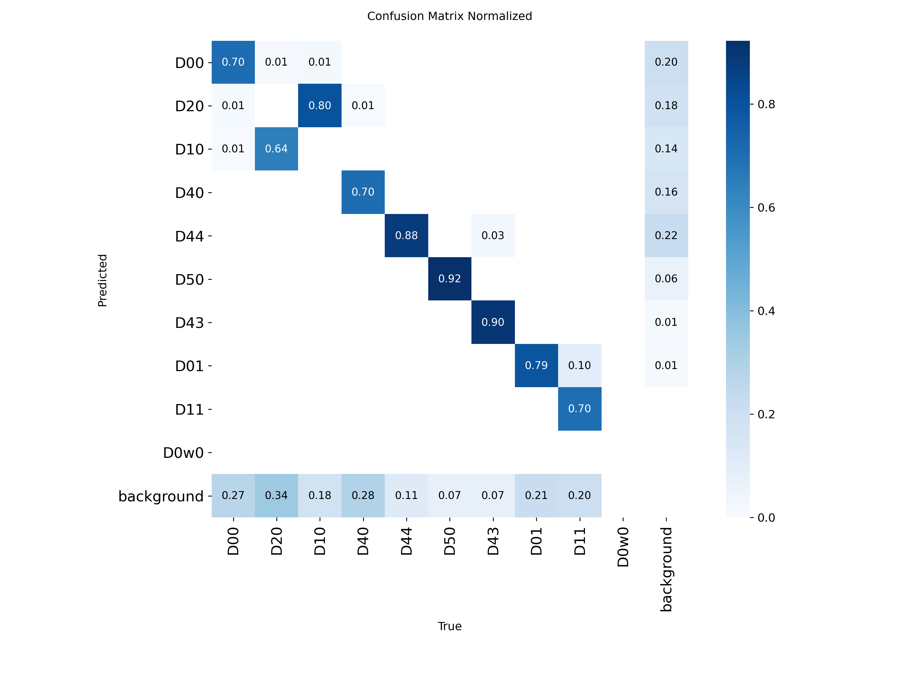

# Road Damage Index (RDI) System

This repository contains the backend and machine learning inference pipeline for the Road Damage Index (RDI) project. It provides a FastAPI service that processes bulk road imagery, detects anomalies using a custom-trained YOLOv8m model, calculates a priority score, and serves the results to a frontend dashboard.

## Architecture & Workflow

1. **Input**: The FastAPI `/upload` endpoint accepts batches of up to 10 images (JPEG, PNG, WEBP) along with geospatial coordinates.
2. **Inference**: Images are passed to a YOLOv8m model trained to detect four classes of road anomalies: Longitudinal Cracks (D00), Transverse Cracks (D10), Alligator Cracks (D20), and Potholes (D40).
3. **Scoring**: Bounding box outputs are mathematically evaluated to generate an RDI score.
4. **Storage**: Raw and processed images (with drawn bounding boxes) are uploaded to an S3 bucket. Metadata and scores are saved to MongoDB.
5. **Retrieval**: The dashboard queries the API for paginated, filterable results.

## Mathematical Model (RDI Calculation)

The Road Damage Index (RDI) is calculated per image to determine the severity of the road segment. It accounts for the cumulative confidence of the model, the highest single detection confidence, and the normalized spatial area of the damage.

$$
RDI = \sum_{i=1}^{N} C_i + \max(C) + W \times \sum_{i=1}^{N} A_i
$$

Where:

- $N$ is the total number of bounding boxes detected.
- $C_i$ is the confidence score of the $i$-th bounding box.
- $A_i$ is the normalized area (width $\times$ height) of the $i$-th bounding box.
- $W$ is the Area Weight constant (set to $2.0$).

Thresholds:

- $RDI \ge 1.50$: **CRITICAL**
- $RDI \ge 0.50$: **HOLD**
- $RDI < 0.50$: **IGNORED** (Assumed clean road, skipped in database)

## Model & Dataset

- **Architecture**: YOLOv8m
- **Epochs for final model**: 70 
- **Dataset**: [RDD2020 Dataset](https://www.kaggle.com/datasets/ziedkelboussi/rdd2020-dataset)
- **Training Notebook**: [Kaggle Implementation](https://www.kaggle.com/code/gourab2004m/notebook994ee35111)
- **Weights & Logs**: [Google Drive Link](https://drive.google.com/drive/folders/1vNYOoQszMie6hffJaICJ9it_989XKbfq?usp=sharing)

### Performance Metrics

The model achieves an overall mAP@50 of ~0.61. Training was monitored up to 100 epochs, but optimal weights were extracted prior to epoch 50, where validation box loss began diverging from training box loss (indicating the onset of overfitting to bounding box memorization).

### Validation Inference

|         Ground Truth Labels         |           Model Predictions            |
| :---------------------------------: | :------------------------------------: |
|  |  |

### Confusion Matrix

## Disclaimer

This project is a student research implementation. The model weights, API, and scoring mechanics are provided for educational and demonstrative purposes only. The maintainers assume no liability for the accuracy of the detections or any decisions made using the outputs of this software.
